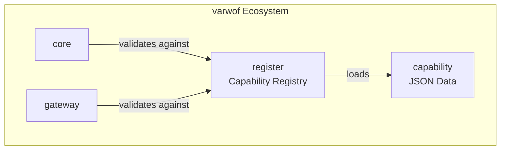

# varwof-capability

> ⭐ Like this repo? Give a star to the flagship one:
> [](https://github.com/varwof/core)

> JSON capability declaration dataset for varwof zero-trust gateways.

> ⚠️ **Preview** — Not for production use. APIs and features may change before official release.

[](LICENSE)

[中文](README_CN.md)

## Provenance and licensing

Every artifact in this repository — the capability data, the CLC specification
text in `docs/`, and the conformance corpora in `data/_vectors/` — is original
work of this project, licensed Apache-2.0, and carries no copied third-party
material.  Implementations here are written from published specifications; the
Internet-Drafts cited in the CLC text are referenced as work in progress, not as
normative sources, and no third-party code was copied into this repository.

## What is varwof-capability?

JSON-format capability definitions for varwof zero-trust gateways: `std` (standard capabilities) and `varwof` (core/gateway/constraint capabilities), plus `x-vendor` (private extensions).  Third-party vendor namespaces are contributed by their owners and are not published from this repository. Loaded by the `register` module for PKCS#7 signature verification and permission validation.

## Quick Start

```bash
export CAPABILITY_DIR=/path/to/capability/data
ls data/
# std/database-v1/v1.json
# std/clinical-v1/v1.json
# std/payments-v1/v1.json
# std/data-v1/v1.json
# varwof/core/v1.json
# varwof/gateway/v1.json
# varwof/constraint/v1.json
# std/database-v1/v1.json
# x-vendor/acme-v1/v1.json
```

## Data Structure

```
data/
├── std/database-v1/v1.json         — Standard database capability schema
├── std/clinical-v1/v1.json         — Clinical IS capabilities (records, orders, prescribing)
├── std/payments-v1/v1.json         — Payments capabilities (transfers, payouts, KYC, refunds)
├── std/data-v1/v1.json             — Data & privacy capabilities (read/export/join/train/delete)
├── varwof/core/v1.json             — Core permissions (37 capabilities + 10 roles)
├── varwof/gateway/v1.json          — Gateway permissions (21 capabilities + 5 roles)
├── varwof/constraint/v1.json       — Execution constraint capabilities
├── std/database-v1/v1.json         — database operation permissions (params_schema)
└── x-vendor/acme-v1/v1.json           — Private extension example
```

## Neutrality

CLC and the corpora in this repository are meant to be usable by third parties,
not held by their authors:

- **No per-vendor extension in the core.** New behaviour enters through the
  `(scheme,type)` namespace or a profile, never by editing the core language for
  one vendor.  A carrier is not privileged: CLC does not require AIC, EMILIA, or
  any other particular credential or evidence format.
- **One corpus, everyone's.** Conformance is measured only against the public
  corpora in `data/_vectors/clc-v1/`.  There is no private, paid, or
  early-access vector set, and no implementer gets vectors others cannot have.
- **Complete and free.** The corpora are published in full, are licensed
  Apache-2.0 together with the specification text, and stay that way.
- **No exclusivity.** Nothing here requires a transport, a vendor, a model
  provider, or a hosting platform, and no such party is granted a privileged
  extension point.
- **Claims follow evidence.** We do not claim a conformance class we cannot back
  with a published corpus and a runnable check.

This is our own statement about this project's artifacts (it is not a
restatement of any other project's covenant), and it applies to the CLC
specification, the corpora, and the reference implementation in
[`varwof/register`](https://github.com/varwof/register).

## CLC-v1 specification

- [`docs/capability-language-core-v1.md`](docs/capability-language-core-v1.md) — the
  **English canonical** language specification (CLC-v1).
- [`docs/capability-language-core-v1-zh.md`](docs/capability-language-core-v1-zh.md) —
  **Chinese reference translation** of the same text (for review; the English text
  prevails where the two differ).  It carries §1–§12.1 and Appendix A in full; the
  per-vector tables of Appendix B are not duplicated, to avoid two diverging copies.

## CLC-v1 conformance vectors and schemes

This repository also carries the machine-readable side of **CLC-v1** (the
minimal capability decision language):

- `data/_vectors/clc-v1/` — **107 conformance vectors** and **32 evidence-side vectors**
  (`evidence-vectors.json`: evidence constraints, requirements, `ActionId` and
  `Match`), `vectors.schema.json`, `clc-v1-ambiguities.md`
  (resolution log), **1184 deterministic P11 property cases**
  (`property-cases.json`, generated by `scripts/gen-property-cases.py`) and
  **12 OCMP offline cases** (`offline-vectors.json`).  Consumer
  implementations: [`varwof/register`](https://github.com/varwof/register) (Go),
  [`varwof/aic-capability-demo`](https://github.com/varwof/aic-capability-demo)
  (Python) and its [`ts/`](https://github.com/varwof/aic-capability-demo/tree/main/ts)
  (TypeScript, Node-only, zero dependencies); all three are asserted on
  **verdict, normative reason code and the merged intersection result**
  (`result_params` / `result_constraints`), the `allow_unresolved` verdict and
  §9.1 multi-grant aggregation of rev CLC-1.3, and the property and offline
  checks run in CI (`scripts/`).
- `data/std/robot-line-v1/v1.json` — industrial robot line capabilities
  (10 capabilities).  Categorical station ids are expressed as arrays
  (`"station": [1,2,3]`) per the CLC-v1 enum rule.
- `data/std/clinical-v1/`, `data/std/payments-v1/`, `data/std/data-v1/` —
  stress-test schemes for CLC v1: coexistence/quorum, cumulative-quota, and
  purpose/region classification. Scheme-scoped constraint types
  (`clinical:quorum:2`, `payments:quota:daily:<n>`, `data:purpose:<v>`,
  `data:region:<v>`) are declared as § extension points and, being unknown to
  CLC v1's known constraint set, fail closed (`deny("unknown_constraint")`)
  until CLC v2 defines them (see design-notes §18).
- Specifications in this repository: `docs/capability-language-core-v1.md`
  (normative), `docs/capability-language-core-principles-v1.md` (design
  principles), `docs/offline-capability-manifest-profile-v0.md` (disconnected
  deployments) and `docs/design-notes.md` (English decision record),
  `docs/capability-language-core-design-notes-zh.md` (full Chinese history).

Design principle in one line: a **minimal decision language** — finite values,
three relations (entailment, match, intersection), two decision functions,
**no control flow**, fail-closed by default, and **an undeclared parameter does
not constitute a grant**.

The principles statement (rev 2) carries P1–P12 plus four properties that can be
run: **local decidability** (no core rule may need the network), **bounded
work** (params ≤ 512 bytes, nesting ≤ 32 levels, over the limit → deny),
**composition narrows only** (an intersection must be covered by every source
and must not depend on source order), and **agreement is the bar** (≥ 2
independent implementations agreeing on verdict and reason).  Each principle is
bound to a clause and to vectors or tests; the ledger and the recorded gaps are
in `docs/capability-language-core-principles-v1.md` §7–§9.

## Ecosystem



capability is the **capability data layer** of the varwof ecosystem. This project is a member of the [Open Invention Network](https://openinventionnetwork.com/).

## Links

| | |
|---|---|
| Homepage | https://varwof.com |
| Community | https://varwof.org |
| IETF Draft | [draft-wei-aic-identity-cert](https://datatracker.ietf.org/doc/draft-wei-aic-identity-cert/) |
| License | Apache-2.0 |
| Member | [Open Invention Network](https://openinventionnetwork.com/) |
