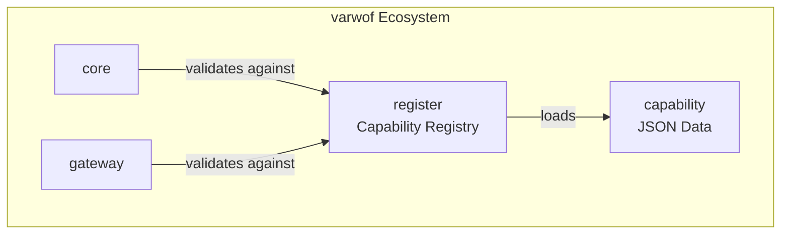

# varwof-capability

> JSON capability declaration dataset for varwof zero-trust gateways.

> ⚠️ **Preview** — Not for production use. APIs and features may change before official release.

[](LICENSE)

[中文](README_CN.md)

## What is varwof-capability?

JSON-format capability definitions for varwof zero-trust gateways: `std` (standard database capabilities), `varwof` (core/gateway/constraint capabilities), `oracle` (MySQL operation capabilities), and `x-vendor` (private extensions). Loaded by the `register` module for PKCS#7 signature verification and permission validation.

## Quick Start

```bash
export CAPABILITY_DIR=/path/to/capability/data
ls data/
# std/database-v1/v1.json
# varwof/core/v1.json
# varwof/gateway/v1.json
# varwof/constraint/v1.json
# oracle/mysql/v1.json
# x-vendor/acme/v1.json
```

## Data Structure

```
data/
├── std/database-v1/v1.json         — Standard database capability schema
├── varwof/core/v1.json             — Core permissions (37 capabilities + 10 roles)
├── varwof/gateway/v1.json          — Gateway permissions (21 capabilities + 5 roles)
├── varwof/constraint/v1.json       — Execution constraint capabilities
├── oracle/mysql/v1.json            — MySQL operation permissions
└── x-vendor/acme/v1.json           — Private extension example
```

## Ecosystem



capability is the **capability data layer** of the varwof ecosystem. This project is a member of the [Open Invention Network](https://openinventionnetwork.com/).

## Links

| | |
|---|---|
| Homepage | https://varwof.com |
| Community | https://varwof.org |
| IETF Draft | [draft-wei-aic-identity-cert](https://datatracker.ietf.org/doc/draft-wei-aic-identity-cert/) |
| License | Apache-2.0 |
| Member | [Open Invention Network](https://openinventionnetwork.com/) |
