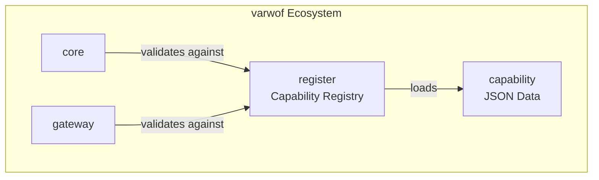

# varwof-capability

> Varwof AIC 套件的一部分 —— 旗舰仓库：[aic-agent](https://github.com/varwof/aic-agent) · [aic-verifier](https://github.com/varwof/aic-verifier) · [aic-exec](https://github.com/varwof/aic-exec)

> varwof 零信任网关的 JSON 能力声明数据集。

> ⚠️ **预览版** — 不可用于生产环境。API 和功能可能在正式发布前发生变更。

[](LICENSE)

[English](README.md)

## 出处与许可

本仓的**全部产物** —— 能力数据、`docs/` 下的 CLC 规范文本、`data/_vectors/` 下的一致性语料
—— 均为本项目原创，采用 Apache-2.0，不含任何照搬的第三方材料。实现按公开规范编写；
规范文本中引用的 Internet-Draft 一律以 work in progress 形式列出，不作为规范性来源；
本仓未复制任何第三方代码。

## 什么是 varwof-capability？

为 varwof 零信任网关提供 JSON 格式的能力定义数据：`std`（标准能力）与 `varwof`
（core/gateway/constraint 能力），以及 `x-vendor`（私有扩展）。第三方厂商命名空间由各所有者
自行贡献，本仓不代为发布。被 `register` 模块加载用于 PKCS#7 签名验证和权限校验。

## 快速开始

```bash
export CAPABILITY_DIR=/path/to/capability/data

# 列出全部 scheme 文件（按消费方的寻址形式 <厂商>/<产品>-v<主版本>/v<主版本>.json）
find "$CAPABILITY_DIR" -name 'v1.json' -not -path '*_vectors*' | sort

# 查看一个 scheme 实际声明了什么
python3 -c "import json,sys; d=json.load(open(sys.argv[1])); \
print(d['scheme_id'], d['version'], len(d['capabilities']), 'caps', len(d['roles']), 'roles')" \
  "$CAPABILITY_DIR/varwof/core-v1/v1.json"
# -> varwof/core-v1 1.1.0 37 caps 10 roles

# 校验语料与 schema 门禁（不联网、无依赖）
python3 scripts/check-offline-vectors.py
```

消费这些数据的三个同作者实现是
[`varwof/register`](https://github.com/varwof/register)（Go —— 参考实现）、
[`varwof/aic-capability-demo`](https://github.com/varwof/aic-capability-demo)（Python）
及其 [`ts/`](https://github.com/varwof/aic-capability-demo/tree/main/ts)（TypeScript）。

## 数据结构

共 14 个 scheme 文件、112 项能力、17 个角色：

```
data/
├── std/clinical-v1/v1.json         — 临床信息系统（7 项能力）
├── std/database-v1/v1.json         — 数据库操作（7 项能力 + 2 个角色）
├── std/data-v1/v1.json             — 数据与隐私（5 项能力）
├── std/deploy-v1/v1.json           — 部署 / 基础设施（3 项能力）
├── std/mcp-v1/v1.json              — MCP 工具访问（1 项能力）
├── std/payments-v1/v1.json         — 支付（6 项能力）
├── std/robot-line-v1/v1.json       — 工业机器人产线（10 项能力）
├── std/wallet-v1/v1.json           — 数字钱包（3 项能力）
├── varwof/constraint-v1/v1.json    — 系统约束：max_rows / time / network（§8.1）
├── varwof/core-v1/v1.json          — PKI 核心（37 项能力 + 10 个角色）
├── varwof/demo-mysql-v1/v1.json    — MySQL API 网关演示夹具（5 项能力）
├── varwof/gateway-v1/v1.json       — 网关（21 项能力 + 5 个角色）
├── varwof/llm-v1/v1.json           — LLM API（1 项能力）
└── x-vendor/acme-v1/v1.json        — 私有扩展示例（3 项能力）
```

`data/_vectors/` 存放 CLC 一致性语料（见
[一致性向量与 scheme](#clc-v1-一致性向量与-scheme)）；它不是 scheme 命名空间，
消费方在枚举 `data/` 时必须排除它。

## 中立性

CLC 与本仓的语料面向**第三方可用**，而不是作者专有：

- **核心不做按厂商的扩展**。新行为通过 `(scheme,type)` 命名空间或 profile 进入，
  绝不为了某一家去改核心语言；载体不被优待 —— CLC 不要求 AIC、EMILIA 或任何特定的
  凭证/证据格式。
- **一份语料，人人可用**。一致性只对 `data/_vectors/clc-v1/` 下的公开语料度量；
  没有私有、付费或提前访问的向量集，也没有哪个实现者能拿到别人拿不到的向量。
- **完整且免费**。语料完整公开，与规范文本同为 Apache-2.0，并将一直如此。
- **无排他**。本仓不要求任何传输、厂商、模型提供方或托管平台，也不给这些主体预留特权扩展点。
- **主张跟着证据走**。没有公开语料与可运行校验支撑的一致性类，我们不会声称。

以上是本项目对自己产物的声明（不是对任何其他项目 covenant 的重述），适用于 CLC 规范、
语料，以及 [`varwof/register`](https://github.com/varwof/register) 中的参考实现。

## CLC-v1 规范

- [`docs/capability-language-core-v1.md`](docs/capability-language-core-v1.md) —— **英文正本**（规范权威）。
- [`docs/reference/`](docs/reference/) —— **16 页可读语言参考**（开发者文档，非规范正本）。
  中文版：[`docs/reference/zh/`](docs/reference/zh/)，与英文参考页同步维护，已覆盖 §13 与附录 C。

## CLC-v1 一致性向量与 scheme

本仓同时承载 **CLC-v1**（极小能力判定语言）的机器可读部分：

- `data/_vectors/clc-v1/` —— **146 条一致性向量**与 **32 条证据侧向量**
  （`evidence-vectors.json`：证据约束、requirements、`ActionId` 与 `Match`）、
  `vectors.schema.json`、`clc-v1-ambiguities.md`（裁决记录）、
  **1184 条确定性 P11 属性用例**（`property-cases.json`，由
  `scripts/gen-property-cases.py` 生成）与 **12 条 OCMP 离线用例**
  （`offline-vectors.json`）。消费方实现：
  [`varwof/register`](https://github.com/varwof/register)（Go）、
  [`varwof/aic-capability-demo`](https://github.com/varwof/aic-capability-demo)（Python）
  与其 [`ts/`](https://github.com/varwof/aic-capability-demo/tree/main/ts)
  （TypeScript，仅 Node、零依赖）；三方断言 **verdict、规范码 reason 与交集结果
  （`result_params` / `result_constraints`）**，覆盖 rev CLC-1.3 的
  `allow_unresolved` 独立 verdict 与 §9.1 多 grant 聚合；属性测试与 offline 检查在 CI 中
  运行（`scripts/`）。
- `data/_vectors/clc-d/` —— **CLC-D 委派包含**语料（rev CLC-1.9，规范 §13）：
  **64 条包含向量**、**784 条前向闭包属性用例**（`scripts/gen-contain-property-cases.py`）
  与 **44 条跨厂商 crosswalk 向量**（AIC-JWT DA、OAuth RAR、UCAN、委派链、ATN、AAT、AIP、
  AAE、AOA、AEGIS）。该关系及其 profile 契约、reason code 与载体映射见规范 §13 与附录 C。
- `data/_vectors/clc-v1/param-bounds-vectors.json` —— §6.5 扩展参数界的 **43 条向量**
  （rev CLC-1.10）：闭区间、`step`、枚举基数、可选键、嵌套递归、scheme 默认值与
  单表示绑定规则，配 `param-bounds-vectors.schema.json`。
- `data/_vectors/clc-v1/resolve-vectors.json` —— §8.5 `Resolve` 消费方循环的 **26 条向量**
  （rev CLC-1.11）：终止直通、全满足消解、部分残余、违反、冲突优先级、
  `time:window` 核心时钟及其 TTL 过期，以及畸形输入，配 `resolve-vectors.schema.json`。
- `data/_vectors/clc-v1/constraint-union-vectors.json` —— §7.1 `ConstraintUnion` 派生投影的
  **12 条向量**（rev CLC-1.12）：链约束的规范化、确定性有序并集，配
  `constraint-union-vectors.schema.json`。
- `data/_vectors/clc-d/authorize-chain-vectors.json` —— §13.11 `AuthorizeWithChain`
  融合链检查的 **15 条向量**（rev CLC-1.13）：逐跳 `Contains`，再
  `Authorize(Intersect(chain))`，配 `authorize-chain-vectors.schema.json`。
- `data/_vectors/clc-v1/param-bounds-meet-vectors.json` —— §6.6 `BoundMeet` 求交的
  **27 条向量**（rev CLC-1.14/1.15）：数值 `min`/`max`/`step` 求交（含更粗网格与
  fail-closed 的 step 用例）、枚举求交与基数、`optional` 合取、`nested` 递归、
  跨族拒绝（`invalid_params_binding`，CLC-1.15）、空与不可表示的 meet、空 Bound 恒等与
  跨站点拒绝，配 `param-bounds-meet-vectors.schema.json`。
- `data/_vectors/clc-v1/param-bounds-equality-vectors.json` —— §6.5 JSON 类型敏感枚举相等的
  **11 条向量**（rev CLC-1.15）：`true ≠ 1`、双向的 `"1" ≠ 1`，在顶层与 `nested` 内、
  数组请求上逐元素比较，数值按 §6.2 规范化后比较（`1 = 1.0`），配
  `param-bounds-equality-vectors.schema.json`。
- `data/_vectors/clc-v1/constraint-union-collation-vectors.json` —— 钉住 §7.1 UTF-8
  字节序排序的 **2 条向量**（rev CLC-1.15）：区分 UTF-8 字节序与 UTF-16 码元序的非 BMP
  用例，以及重复折叠 / 链序无关性，配 `constraint-union-collation-vectors.schema.json`。
- `data/_vectors/clc-v1/param-bounds-meet-property-cases.json` —— §6.6 meet 不变式的
  **500 条用例**（rev CLC-1.15）：每个成功的 meet 只授权**每一个**来源都授权的内容
  （由 `scripts/gen-param-bounds-meet-property-cases.py` 生成；CI 断言生成文件与已提交文件
  逐字节一致）。
- `data/std/robot-line-v1/v1.json` —— 工业机器人产线能力（10 项能力）。分类工位 id 按
  CLC-v1 的枚举规则用数组表示（`"station": [1,2,3]`）。
- `data/std/clinical-v1/`、`data/std/payments-v1/`、`data/std/data-v1/` —— CLC v1 的
  压力测试 scheme：共存/法定人数、累计配额、目的/地域分类。scheme 域内的约束类型
  （`clinical:quorum:2`、`payments:quota:daily:<n>`、`data:purpose:<v>`、
  `data:region:<v>`）作为 § 扩展点声明，因 CLC v1 的已知约束集不认识它们，
  在 CLC v2 定义之前 fail-closed（`deny("unknown_constraint")`）
  （见 design-notes §18）。
- 本仓内的规范文档：`docs/capability-language-core-v1.md`（规范正文）、
  `docs/capability-language-core-principles-v1.md`（设计原则）、
  `docs/offline-capability-manifest-profile-v0.md`（离线部署）与
  `docs/design-notes.md`（英文裁决记录）、
  `archive/capability-language-core-design-notes-zh.md`（完整中文历史，2026-09-24 归档）。

设计原则一句话：**极小的判定语言**——有限的值、四条关系（蕴含/匹配/交集/包含）、两个判定
函数、**没有控制流**、缺省即拒绝（fail-closed）、**未声明的参数不构成授予**。

原则声明（rev 4）共 P1–P12，另有四条"可被跑"的性质：**本地可判**（核心规则不得联网）、
**有界工作量**（参数 ≤512 字节、嵌套 ≤32 层，超限即拒）、**组合只收窄**（交集必须被每个源
覆盖且与顺序无关）、**一致即门槛**（≥2 个独立实现 verdict 与规范码一致才算完成）。每条原则
绑定规范条文 + 向量/测试，台账与已记录的缺口见
`docs/capability-language-core-principles-v1.md` §7–§9。

## 生态



capability 是 varwof 生态的**能力数据层**。本项目是 [Open Invention Network](https://openinventionnetwork.com/) 成员。

### 相关仓库

| 仓库 | 是什么 |
|---|---|
| [`varwof/register`](https://github.com/varwof/register) | 加载这些 scheme、为其签名并执行 CLC-v1 的 Go 参考实现（[English](https://github.com/varwof/register/blob/main/README.md)） |
| [`varwof/aic-capability-demo`](https://github.com/varwof/aic-capability-demo) | 消费同一批语料的 Python 与 TypeScript 移植（[English](https://github.com/varwof/aic-capability-demo/blob/main/README.md)） |

## 链接

| | |
|---|---|
| 主页 | https://varwof.com |
| 社区 | https://varwof.org |
| IETF 草案 | [draft-wei-aic-identity-cert](https://datatracker.ietf.org/doc/draft-wei-aic-identity-cert/) |
| 许可证 | Apache-2.0 |
| 成员 | [Open Invention Network](https://openinventionnetwork.com/) |